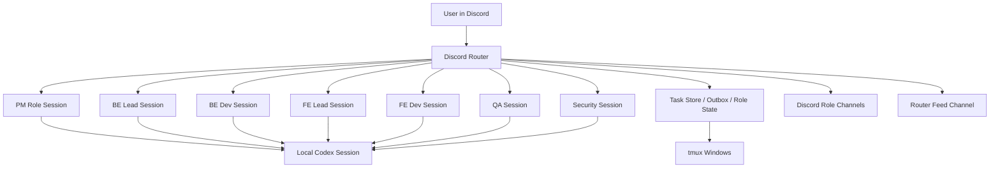

# Discord Agents

Persistent Discord role agents powered by local Codex sessions, `tmux`, and a lightweight Python router.

This project lets you run a small multi-role software team inside Discord:

- `PM`
- `BE Lead`
- `BE Dev`
- `FE Lead`
- `FE Dev`
- `QA`
- `Security`

Each role can:

- listen in its own Discord channel
- keep a long-running Codex conversation context
- respond in Korean
- coordinate through a router feed
- escalate important warnings with a direct owner mention
- help leads review and commit scoped work on the current branch

This repository is designed to be usable by other people without the original VlaInter project.

## What This Is

This is **not** a hosted SaaS and **not** a cloud-only Discord bot.

It is a **local orchestration project** that runs on your machine:

- Discord bot for message ingress/egress
- local Python router
- per-role worker runtime
- persistent Codex sessions via `codex exec` + `codex exec resume`
- `tmux` session for visibility and process management

Think of it as:

1. Discord is the chat surface.
2. `tmux` is the local operations console.
3. Codex is the actual role brain.
4. The Python router is the glue.

## Core Features

- Role-based Discord channels
- Persistent per-role Codex memory
- Router feed for cross-role visibility
- Owner mention on `[주의]`, `[차단]`, `[리스크]`
- Lead-only scoped auto-commit flow
- Task registry with task IDs
- Shared task handoff model
- Local-first setup with no required database

## Architecture



## Repository Layout

```text
Discord_Agents/
├── agent_team/
│   ├── cli.py
│   ├── config.py
│   ├── discord_router.py
│   ├── git_ops.py
│   ├── requirements.txt
│   ├── runner.py
│   └── store.py
├── docs/
│   ├── discord-bot-setup.md
│   └── discord-tmux-orchestrator-mvp.md
├── scripts/
│   ├── agent_team_cli.sh
│   ├── attach_agent_team_tmux.sh
│   ├── install_agent_team_deps.sh
│   ├── start_agent_team_tmux.sh
│   └── stop_agent_team_tmux.sh
├── .agent_team.env.example
├── .gitignore
└── README.md
```

## Requirements

You need all of the following on the local machine:

- macOS or Linux shell environment
- Python 3.9+
- `tmux`
- local `git`
- local `codex` CLI already installed and authenticated
- a Discord bot token
- a Discord server where the bot has access to your channels

## Important Security Note

By default this project is configured to run role Codex sessions with:

```text
AGENT_TEAM_CODEX_PERMISSION_MODE=danger-full-access
```

That means role sessions can execute with broad permissions.

This is intentional for low-friction local workflows, but you should only use it:

- on a machine you control
- in a repository you trust
- with strong lead/PM governance

If you want a safer setup, change the mode to:

- `workspace-write`
- `read-only`

## Step 1. Install Dependencies

From the repository root:

```bash
./scripts/install_agent_team_deps.sh
```

This will:

- create a local `.venv`
- install `discord.py`

## Step 2. Prepare Environment Variables

Copy the example file:

```bash
cp .agent_team.env.example .agent_team.env
```

Fill in your real values.

### Example

```env
DISCORD_BOT_TOKEN=

DISCORD_CHANNEL_ID=

DISCORD_ROUTER_CHANNEL_ID=
DISCORD_PM_CHANNEL_ID=
DISCORD_BACKEND_CHANNEL_ID=
DISCORD_FRONTEND_CHANNEL_ID=
DISCORD_QA_CHANNEL_ID=
DISCORD_SECURITY_CHANNEL_ID=
DISCORD_OWNER_USER_ID=

DISCORD_BE_LEAD_CHANNEL_ID=
DISCORD_BE_DEV_CHANNEL_ID=
DISCORD_FE_LEAD_CHANNEL_ID=
DISCORD_FE_DEV_CHANNEL_ID=

AGENT_TEAM_USE_CODEX_EXEC=1
AGENT_TEAM_CODEX_TIMEOUT_SECONDS=120
AGENT_TEAM_CODEX_PERMISSION_MODE=danger-full-access
```

### Variable Guide

`DISCORD_BOT_TOKEN`

- Your Discord bot token.

`DISCORD_ROUTER_CHANNEL_ID`

- A central channel where mirrored updates are shown.
- Good for leadership oversight and cross-role visibility.

`DISCORD_PM_CHANNEL_ID`

- PM/user-facing coordination channel.

`DISCORD_BACKEND_CHANNEL_ID`

- Backend shared channel.
- User messages here are routed to `BE Lead`.
- `BE Lead` and `BE Dev` can both respond into this channel.

`DISCORD_FRONTEND_CHANNEL_ID`

- Frontend shared channel.
- User messages here are routed to `FE Lead`.
- `FE Lead` and `FE Dev` can both respond into this channel.

`DISCORD_QA_CHANNEL_ID`

- QA-specific channel.

`DISCORD_SECURITY_CHANNEL_ID`

- Security-specific channel.

`DISCORD_OWNER_USER_ID`

- Discord user ID that should be mentioned on important alerts.
- If a role reply begins with `[주의]`, `[차단]`, or `[리스크]`, that owner is pinged.

`DISCORD_BE_LEAD_CHANNEL_ID`, `DISCORD_BE_DEV_CHANNEL_ID`, `DISCORD_FE_LEAD_CHANNEL_ID`, `DISCORD_FE_DEV_CHANNEL_ID`

- Optional fine-grained overrides if you want separate lead/dev channels instead of shared backend/frontend channels.

`AGENT_TEAM_USE_CODEX_EXEC`

- `1` means role workers call real local Codex.
- `0` means fallback non-Codex behavior.

`AGENT_TEAM_CODEX_TIMEOUT_SECONDS`

- Per-message timeout for Codex execution.

`AGENT_TEAM_CODEX_PERMISSION_MODE`

- Permission level for role Codex sessions.

## Step 3. Create Discord Channels

Recommended structure:

- `#router`
- `#pm`
- `#backend`
- `#frontend`
- `#qa`
- `#security`

Recommended routing:

- `#router` -> PM entrypoint + router feed view
- `#pm` -> PM
- `#backend` -> BE Lead by default
- `#frontend` -> FE Lead by default
- `#qa` -> QA
- `#security` -> Security

## Step 4. Start the Local Team

```bash
./scripts/start_agent_team_tmux.sh --recreate
```

Attach to the session:

```bash
./scripts/attach_agent_team_tmux.sh
```

Stop everything:

```bash
./scripts/stop_agent_team_tmux.sh
```

## tmux Layout

The default session is named `agent-team`.

Windows:

- `router`
- `pm`
- `backend`
- `frontend`
- `review`
- `logs`

Pane layout:

- `backend`: `BE Lead` + `BE Dev`
- `frontend`: `FE Lead` + `FE Dev`
- `review`: `QA` + `Security`

## How Persistent Role Memory Works

Each role stores its own Codex `session_id`.

Flow:

1. first role message -> `codex exec`
2. router extracts `thread.started`
3. role state stores the session id
4. next role message -> `codex exec resume <session_id>`

This means:

- PM remembers PM conversations
- QA remembers QA conversations
- BE Lead remembers backend lead conversations

Memory is currently **persistent per role**, not per task.

## How to Talk to the Agents

### Natural Language Mode

You can just talk normally in the role channels.

Examples:

In `#pm`

```text
결제 콜백 세션 만료 문제를 작업 단위로 쪼개 주세요.
```

In `#backend`

```text
TASK-20260416-123456-abcd 기준으로 백엔드 리스크부터 정리해 주세요.
```

In `#qa`

```text
이 플로우에서 재현 가능한 실패 시나리오를 먼저 뽑아 주세요.
```

### Command Mode

Supported commands:

```text
!task <title>
!handoff <task_id> <from_role> <to_role> <message>
!scope <task_id> <path> [path...]
!review-done <task_id> <commit_message>
!status
!status <task_id>
```

## Task Model

Tasks are stored in a local JSON task registry.

Each task contains:

- `task_id`
- `title`
- `status`
- `owner_role`
- `assigned_role`
- `thread_id`
- `write_scope`
- `requester_user_id`

Task IDs look like:

```text
TASK-20260416-160614-8125
```

## Router Feed

The router feed mirrors role updates from other channels into `#router`.

Use it when you want:

- one place to watch all issue sharing
- a leadership dashboard for PM/lead activity
- a single place to catch blockers and risks

## Owner Mentions on Alerts

If a role message starts with one of these exact tags:

- `[주의]`
- `[차단]`
- `[리스크]`

then the configured owner account is mentioned:

- in the original role channel
- in the router feed

This is useful for:

- blockers
- dangerous actions
- security issues
- infra failures
- review risks

## Lead Review and Auto Commit

Lead channels can finalize a reviewed task with auto-commit.

### 1. Register scope

```text
!scope TASK-20260416-123456-abcd agent_team/runner.py agent_team/discord_router.py
```

### 2. Complete review and commit

In the backend or frontend lead channel:

```text
!review-done TASK-20260416-123456-abcd [fix] finish backend lead review
```

### What Happens

- only the registered `write_scope` files are staged
- the current branch is used
- a commit is created
- PM receives a handoff update
- the Discord channel gets branch + commit hash feedback

### Safety Behavior

Auto commit will refuse to run when:

- there is no `write_scope`
- there are no changes in the scoped paths
- Git errors occur
- the branch is invalid or detached

This avoids accidentally committing the entire repository.

## Recommended Team Governance

If you run with broad permissions, use this discipline:

- PM filters ambiguous or high-risk requests
- Leads reject destructive or unreasonable execution
- Dev roles only act within scoped work packets
- QA and Security report risks with explicit tags
- Owner is pinged on serious issues

Recommended command chain:

1. user speaks to PM
2. PM decomposes
3. lead reviews and delegates
4. dev implements
5. QA/Security report back
6. lead approves
7. lead commits scoped work
8. PM reports final status

## Troubleshooting

### The bot replies in Discord but does not remember context

Check:

- `AGENT_TEAM_USE_CODEX_EXEC=1`
- role session ids in runtime state
- Codex CLI authentication

### The bot does not answer in Discord

Check:

- bot token
- channel IDs
- tmux session is running
- `router` window logs
- `logs` window events/outbox

### Codex takes too long

Increase:

```env
AGENT_TEAM_CODEX_TIMEOUT_SECONDS=180
```

### You want fewer privileges

Change:

```env
AGENT_TEAM_CODEX_PERMISSION_MODE=workspace-write
```

### Auto commit says there is no scope

Register scope first:

```text
!scope TASK-... path/to/file path/to/another/file
```

## Files That Must Never Be Committed

Do not commit:

- `.agent_team.env`
- bot tokens
- private SSH keys
- local runtime data in `.codex-tmp/`
- personal IDE settings

This repository includes `.gitignore` rules for the common local-only files.

## Suggested Next Upgrades

If you want to evolve this system further:

1. task-scoped persistent Codex sessions
2. `fork`-based deep investigation threads
3. message embeds for Router Feed severity
4. PR creation after lead review
5. richer shared task board UI
6. remote deployment instead of local-only runtime

## Quick Start Checklist

1. Install `tmux`
2. Install `codex`
3. Authenticate Codex locally
4. Create a Discord bot
5. Create your role channels
6. Fill `.agent_team.env`
7. Run `./scripts/install_agent_team_deps.sh`
8. Run `./scripts/start_agent_team_tmux.sh --recreate`
9. Talk to `#pm` or `#router`
10. Watch `#router` for team-wide updates
