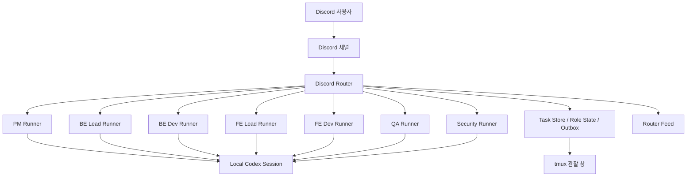

# Discord Agents

Discord 안에서 `PM`, `BE Lead`, `BE Dev`, `FE Lead`, `FE Dev`, `QA`, `Security` 역할을 나눠 운영할 수 있도록 만든 로컬 멀티 에이전트 오케스트레이션 프로젝트입니다.

이 저장소는 다음 목표를 위해 만들어졌습니다.

- Discord를 팀 커뮤니케이션 UI로 사용
- 역할별 채널에서 자연어로 대화
- 각 역할이 로컬 `Codex` 세션을 유지하며 맥락을 이어서 응답
- `tmux`로 로컬 런타임을 관찰하고 관리
- 중요 리스크가 생기면 오너를 자동 멘션
- 리드 검토 완료 시 범위 제한 커밋까지 자동화

이 프로젝트는 특정 서비스 코드베이스에 종속되지 않도록 분리되어 있으며, 다른 사용자도 자신의 저장소와 Discord 서버에 맞게 바로 가져다 쓸 수 있게 구성되어 있습니다.

## 한눈에 보기

이 프로젝트는 크게 4개 층으로 이루어져 있습니다.

1. Discord
사용자가 역할별 채널에서 에이전트와 대화하는 인터페이스입니다.

2. Router
Discord 메시지를 받아 적절한 역할 inbox로 보내고, 역할 응답을 다시 Discord 채널과 Router Feed로 중계합니다.

3. Role Runner
PM, Backend Lead, QA 같은 역할별 런타임입니다. 각 역할은 자기 역할에 맞는 응답과 작업 흐름을 유지합니다.

4. Codex Session
각 역할은 로컬 `codex exec` / `codex exec resume`를 사용해 장기 대화 세션을 유지합니다.

## 이 프로젝트가 하는 일

- 역할별 Discord 채널 라우팅
- 역할별 지속 Codex 세션 유지
- 한국어 역할 대화
- `Router Feed`를 통한 전체 팀 상황 가시화
- `[주의]`, `[차단]`, `[리스크]` 메시지에 대한 오너 자동 멘션
- Task ID 기반 작업 추적
- Lead 채널에서 범위 제한 `git commit`

## 이 프로젝트가 아닌 것

- SaaS 제품이 아닙니다.
- 클라우드에서 자동으로 돌아가는 완성형 서비스가 아닙니다.
- 대규모 워크플로 엔진이나 데이터베이스 기반 협업툴이 아닙니다.

이 프로젝트는 기본적으로 **내 로컬 머신에서 실행하는 운영용 도구**입니다.

## 아키텍처



## 폴더 구조

```text
Discord_Agents/
├── agent_team/
│   ├── cli.py
│   ├── config.py
│   ├── discord_router.py
│   ├── git_ops.py
│   ├── requirements.txt
│   ├── runner.py
│   └── store.py
├── scripts/
│   ├── agent_team_cli.sh
│   ├── attach_agent_team_tmux.sh
│   ├── install_agent_team_deps.sh
│   ├── start_agent_team_tmux.sh
│   └── stop_agent_team_tmux.sh
├── skills/
│   ├── project-pm/
│   ├── project-backend-lead/
│   ├── project-backend-dev/
│   ├── project-frontend-lead/
│   ├── project-frontend-dev/
│   ├── project-qa/
│   ├── project-security-review/
│   └── README.md
├── docs/
│   ├── discord-bot-setup.md
│   └── discord-tmux-orchestrator-mvp.md
├── .agent_team.env.example
├── .gitignore
└── README.md
```

## 핵심 컴포넌트 설명

### `agent_team/discord_router.py`

이 프로젝트의 중심입니다.

- Discord 메시지 수신
- 역할별 채널 -> 역할 라우팅
- 역할 응답 -> 대상 채널 전송
- Router Feed 전송
- `!task`, `!scope`, `!review-done`, `!status` 같은 명령 처리

### `agent_team/runner.py`

각 역할의 실행기입니다.

- 역할 inbox를 읽음
- 역할별 프롬프트를 구성함
- `codex exec` 또는 `codex exec resume` 호출
- 응답을 outbox에 기록

### `agent_team/store.py`

파일 기반 상태 저장소입니다.

- task registry
- inbox / outbox
- role state
- 역할별 Codex session id

DB 없이도 작동할 수 있게 단순한 파일 저장 구조를 사용합니다.

### `agent_team/git_ops.py`

리드 검토 완료 후 자동 커밋을 위한 유틸리티입니다.

- 현재 브랜치 확인
- `write_scope` 범위만 stage
- 범위 제한 commit 생성

## 팀 역할 모델

이 저장소는 기본적으로 아래 7개 역할을 가정합니다.

- `PM`
- `BE Lead`
- `BE Dev`
- `FE Lead`
- `FE Dev`
- `QA`
- `Security`

각 역할의 행동 기준은 `skills/` 폴더에 있는 Codex 팀 스킬 문서에 정리되어 있습니다.

즉 이 저장소는 단순히 “봇 코드”만 있는 게 아니라:

- 역할 정의
- 협업 규칙
- 작업 분배 기준
- 리뷰와 보고 방식

까지 함께 제공합니다.

## 왜 `skills/` 폴더를 같이 넣었나

다른 사람이 이 저장소를 봤을 때 가장 궁금한 건 보통 이겁니다.

- PM은 정확히 뭘 하는가
- Backend Lead는 어떤 기준으로 리뷰하는가
- QA는 어떤 방식으로 장애를 찾는가
- Security는 어떤 관점으로 이슈를 올리는가

이걸 코드만 보고 이해하기는 어렵습니다.

그래서 `skills/`를 같이 넣어두면:

- 역할의 의도
- 협업 거버넌스
- reasoning 기준
- handoff 방식

을 함께 전달할 수 있습니다.

자세한 내용은 [skills/README.md](/Users/songchiho/Desktop/Task/vlaInter/Discord_Agents/skills/README.md)를 보시면 됩니다.

## 사전 준비물

이 저장소를 실제로 쓰려면 아래가 필요합니다.

- macOS 또는 Linux 환경
- Python 3.9 이상
- `tmux`
- `git`
- 로컬에 설치된 `codex` CLI
- Codex 로그인 상태
- Discord Bot Token
- Discord 서버와 채널

## 설치 방법

### 1. 저장소 클론

```bash
git clone https://github.com/rktclgh/Codex_Discord_Agents.git
cd Codex_Discord_Agents
```

### 2. 의존성 설치

```bash
./scripts/install_agent_team_deps.sh
```

이 스크립트는:

- `.venv` 생성
- `discord.py` 설치

를 수행합니다.

### 3. Discord 봇 생성 및 서버 연결

이 프로젝트는 Discord Bot Token과 채널 ID가 있어야 동작합니다. 아직 Discord 봇을 만들지 않았다면 아래 순서대로 진행하시면 됩니다.

#### 3-1. Discord Developer Portal에서 앱 생성

1. 브라우저에서 [Discord Developer Portal](https://discord.com/developers/applications) 로 이동합니다.
2. `New Application` 버튼을 누릅니다.
3. 앱 이름을 입력합니다.
   - 예: `Codex Discord Agents`
4. 앱을 생성합니다.

여기까지 하면 아직 "앱"만 있는 상태이고, 실제 메시지를 읽고 쓰는 "봇"은 아직 없습니다.

#### 3-2. Bot 생성

1. 왼쪽 메뉴에서 `Bot` 으로 이동합니다.
2. `Add Bot` 버튼을 눌러 봇을 생성합니다.
3. 생성이 끝나면 같은 화면에서 Bot Token을 발급받을 수 있습니다.

이 토큰은 사실상 봇 비밀번호이므로 절대 공개 저장소에 넣으면 안 됩니다.

#### 3-3. Message Content Intent 켜기

이 프로젝트는 채널에 입력한 자연어 메시지를 읽어야 하므로 `MESSAGE CONTENT INTENT`가 필요합니다.

1. `Bot` 화면 아래쪽의 `Privileged Gateway Intents` 섹션으로 이동합니다.
2. `MESSAGE CONTENT INTENT`를 활성화합니다.
3. 저장합니다.

이 설정이 꺼져 있으면 봇은 채널에 메시지가 왔다는 사실만 알고, 실제 본문을 읽지 못합니다.

#### 3-4. 봇을 내 Discord 서버에 초대하기

1. 왼쪽 메뉴에서 `OAuth2` -> `URL Generator` 로 이동합니다.
2. `Scopes`에서 아래 두 개를 체크합니다.
   - `bot`
   - `applications.commands`
3. `Bot Permissions`는 최소한 아래 정도를 체크합니다.
   - `View Channels`
   - `Send Messages`
   - `Read Message History`
4. 채널별 스레드를 쓸 계획이라면 아래도 같이 체크하는 것을 권장합니다.
   - `Create Public Threads`
   - `Send Messages in Threads`
5. 생성된 초대 링크로 봇을 원하는 Discord 서버에 추가합니다.

#### 3-5. Discord에서 개발자 모드 켜기

채널 ID와 사용자 ID를 복사하려면 개발자 모드가 필요합니다.

1. Discord 앱의 `사용자 설정`으로 이동합니다.
2. `고급` 메뉴로 이동합니다.
3. `개발자 모드`를 켭니다.

#### 3-6. 채널 만들기

권장 채널 구성은 아래와 같습니다.

- `#라우터`
- `#pm`
- `#백엔드`
- `#프론트엔드`
- `#qa`
- `#보안`

원하는 이름으로 만들어도 되지만, README와 기본 예시는 위 이름을 기준으로 설명합니다.

#### 3-7. 채널 ID 복사

각 채널을 우클릭한 뒤 `ID 복사`를 누르면 채널 ID를 얻을 수 있습니다.

필요한 채널 ID:

- `DISCORD_ROUTER_CHANNEL_ID`
- `DISCORD_PM_CHANNEL_ID`
- `DISCORD_BACKEND_CHANNEL_ID`
- `DISCORD_FRONTEND_CHANNEL_ID`
- `DISCORD_QA_CHANNEL_ID`
- `DISCORD_SECURITY_CHANNEL_ID`

#### 3-8. 오너 사용자 ID 복사

리스크 발생 시 특정 계정을 멘션하고 싶다면, Discord에서 본인 프로필을 우클릭해서 `ID 복사`를 하면 됩니다.

이 값은 `DISCORD_OWNER_USER_ID`에 넣습니다.

#### 3-9. Bot Token 복사

`Developer Portal -> Bot` 화면으로 돌아가서 토큰을 복사합니다.

이 값은 `DISCORD_BOT_TOKEN`에 넣습니다.

토큰이 외부에 노출되었다면 즉시 `Reset Token`으로 재발급하고, `.env`도 새 값으로 교체해야 합니다.

### 4. 환경 파일 생성

```bash
cp .agent_team.env.example .agent_team.env
```

그다음 `.agent_team.env`에 실제 값을 채웁니다.

## 환경 변수 설명

예시:

```env
DISCORD_BOT_TOKEN=

DISCORD_CHANNEL_ID=

DISCORD_ROUTER_CHANNEL_ID=
DISCORD_PM_CHANNEL_ID=
DISCORD_BACKEND_CHANNEL_ID=
DISCORD_FRONTEND_CHANNEL_ID=
DISCORD_QA_CHANNEL_ID=
DISCORD_SECURITY_CHANNEL_ID=
DISCORD_OWNER_USER_ID=

DISCORD_BE_LEAD_CHANNEL_ID=
DISCORD_BE_DEV_CHANNEL_ID=
DISCORD_FE_LEAD_CHANNEL_ID=
DISCORD_FE_DEV_CHANNEL_ID=

AGENT_TEAM_USE_CODEX_EXEC=1
AGENT_TEAM_CODEX_TIMEOUT_SECONDS=120
AGENT_TEAM_CODEX_PERMISSION_MODE=danger-full-access
```

설명:

`DISCORD_BOT_TOKEN`

- Discord 봇 토큰입니다.

`DISCORD_ROUTER_CHANNEL_ID`

- 전체 공유 이슈와 Router Feed를 모아보는 채널입니다.

`DISCORD_PM_CHANNEL_ID`

- PM과 대화하는 채널입니다.

`DISCORD_BACKEND_CHANNEL_ID`

- 백엔드 공용 채널입니다.
- 기본적으로 이 채널의 사용자 메시지는 `BE Lead`에게 들어갑니다.

`DISCORD_FRONTEND_CHANNEL_ID`

- 프론트엔드 공용 채널입니다.
- 기본적으로 이 채널의 사용자 메시지는 `FE Lead`에게 들어갑니다.

`DISCORD_QA_CHANNEL_ID`

- QA 전용 채널입니다.

`DISCORD_SECURITY_CHANNEL_ID`

- 보안 전용 채널입니다.

`DISCORD_OWNER_USER_ID`

- `[주의]`, `[차단]`, `[리스크]` 메시지가 발생했을 때 자동 멘션할 Discord 사용자 ID입니다.
- Discord에서 본인 프로필 우클릭 -> `ID 복사`로 가져올 수 있습니다.

`AGENT_TEAM_USE_CODEX_EXEC`

- `1`이면 실제 Codex 실행기를 사용합니다.
- `0`이면 fallback 응답만 사용합니다.

`AGENT_TEAM_CODEX_TIMEOUT_SECONDS`

- 역할별 응답 생성 타임아웃입니다.

`AGENT_TEAM_CODEX_PERMISSION_MODE`

- Codex 실행 권한 모드입니다.
- 기본은 `danger-full-access` 입니다.

## 권한 모드에 대한 주의

이 프로젝트는 기본적으로 다음 설정을 사용합니다.

```text
AGENT_TEAM_CODEX_PERMISSION_MODE=danger-full-access
```

즉, 권한 요청 때문에 흐름이 끊기지 않게 하는 대신 실행 권한이 넓습니다.

이 설정을 쓸 때는 아래 운영 원칙이 중요합니다.

- PM이 애매하거나 무리한 요청을 먼저 걸러야 함
- Lead가 위험하거나 말이 안 되는 요청을 차단해야 함
- Dev는 handoff 받은 범위 중심으로 작업해야 함
- QA / Security는 리스크를 태그로 명확히 올려야 함

원하면 아래처럼 더 안전하게 바꿀 수 있습니다.

```env
AGENT_TEAM_CODEX_PERMISSION_MODE=workspace-write
```

또는

```env
AGENT_TEAM_CODEX_PERMISSION_MODE=read-only
```

## Discord 채널 추천 구조

권장 채널:

- `#router`
- `#pm`
- `#backend`
- `#frontend`
- `#qa`
- `#security`

권장 의미:

- `#router`: 전체 공유/이슈 관찰용
- `#pm`: PM과 직접 대화
- `#backend`: 백엔드 리드/개발 관련
- `#frontend`: 프론트엔드 리드/개발 관련
- `#qa`: QA 관련
- `#security`: 보안 관련

위 권장 이름과 실제 `.env`의 채널 ID 매핑만 맞으면, 채널 이름을 다르게 써도 동작합니다.

## 실행 방법

### 팀 세션 시작

```bash
./scripts/start_agent_team_tmux.sh --recreate
```

### 세션 접속

```bash
./scripts/attach_agent_team_tmux.sh
```

### 세션 종료

```bash
./scripts/stop_agent_team_tmux.sh
```

## tmux 구조

기본 세션 이름은 `agent-team` 입니다.

윈도우:

- `router`
- `pm`
- `backend`
- `frontend`
- `review`
- `logs`

pane 구조:

- `backend`: `BE Lead` / `BE Dev`
- `frontend`: `FE Lead` / `FE Dev`
- `review`: `QA` / `Security`

## 역할별 지속 세션 방식

각 역할은 자기만의 Codex 세션을 가집니다.

흐름:

1. 첫 메시지 -> `codex exec`
2. `thread.started`에서 세션 ID 추출
3. role state에 저장
4. 다음 메시지부터 -> `codex exec resume <session_id>`

즉:

- PM은 PM의 대화 맥락을 유지
- QA는 QA의 대화 맥락을 유지
- BE Lead는 백엔드 리드 맥락을 유지

현재는 **역할별 지속 세션**이며, **task별 세션 분리**는 아직 아닙니다.

## Discord에서 사용하는 방법

### 1. 자연어로 바로 말하기

예를 들면:

`#pm`

```text
결제 콜백 세션 만료 문제를 작업 단위로 쪼개 주세요.
```

`#backend`

```text
TASK-20260416-123456-abcd 기준으로 백엔드 리스크를 먼저 정리해 주세요.
```

`#qa`

```text
이 흐름에서 재현 가능한 실패 시나리오를 먼저 뽑아 주세요.
```

### 2. 명령어 사용하기

지원 명령:

```text
!task <title>
!handoff <task_id> <from_role> <to_role> <message>
!scope <task_id> <path> [path...]
!review-done <task_id> <commit_message>
!status
!status <task_id>
!roles
!health
!help
```

## Task 모델

task는 파일 기반 registry에 저장됩니다.

포함 정보:

- `task_id`
- `title`
- `status`
- `owner_role`
- `assigned_role`
- `thread_id`
- `write_scope`
- `requester_user_id`

예시 ID:

```text
TASK-20260416-160614-8125
```

## Router Feed

`#router` 채널은 단순 PM 채널이 아니라 전체 팀 공유 채널 역할도 합니다.

여기서 볼 수 있는 것:

- 리드가 다른 채널로 보낸 이슈
- QA / Security가 올린 위험 신호
- PM/Lead handoff 흐름
- cross-role 협업 상황

즉 “에이전트끼리 현재 어떤 이슈를 공유하고 있는가”를 한 곳에서 볼 수 있도록 만든 채널입니다.

## 오너 멘션 규칙

역할 응답이 아래 태그 중 하나로 시작하면:

- `[주의]`
- `[차단]`
- `[리스크]`

설정된 오너 계정을 자동 멘션합니다.

멘션 위치:

- 원래 역할 채널
- Router Feed

예:

```text
[리스크] 세션 만료 복구 경로가 없어 결제 성공 후 실패처럼 보일 수 있습니다.
```

이런 메시지는 자동으로 오너 멘션과 함께 올라갑니다.

## Lead 검토 완료 후 자동 커밋

리드가 검토를 마친 뒤, task 범위만 현재 브랜치에 커밋할 수 있습니다.

### 1. 작업 범위 등록

```text
!scope TASK-20260416-123456-abcd agent_team/runner.py agent_team/discord_router.py
```

### 2. 리드 검토 완료 커밋

백엔드/프론트 리드 채널에서:

```text
!review-done TASK-20260416-123456-abcd [fix] finish backend lead review
```

이때 실제로 하는 일:

- `write_scope`에 등록된 파일만 stage
- 현재 브랜치 기준 commit 수행
- PM에게 상태 handoff
- Discord 채널에 브랜치/커밋 해시 보고

### 안전장치

다음 경우 자동 커밋을 거부합니다.

- `write_scope` 없음
- 범위 안에 변경 사항 없음
- detached HEAD
- git 오류 발생

즉 저장소 전체를 실수로 커밋하지 않도록 막아둔 구조입니다.

## 스킬 문서 사용법

역할별 스킬은 `skills/` 폴더에 있습니다.

포함된 역할:

- `project-pm`
- `project-backend-lead`
- `project-backend-dev`
- `project-frontend-lead`
- `project-frontend-dev`
- `project-qa`
- `project-security-review`

이 문서들을 보면:

- 각 역할이 무엇을 책임지는지
- 어떤 reasoning 수준을 기대하는지
- handoff와 review를 어떻게 해야 하는지

를 바로 이해할 수 있습니다.

## 추천 운영 방식

권장 흐름:

1. 사용자 -> PM
2. PM -> Lead 분해
3. Lead -> Dev 작업 분배
4. QA / Security -> Lead 피드백
5. Lead 검토 완료
6. scoped auto-commit
7. PM 최종 보고

## 트러블슈팅

### Discord에 답이 안 온다

확인할 것:

- bot token
- channel ID
- tmux 세션 실행 여부
- `router` 윈도우 로그
- `logs` 윈도우 outbox/events

### 역할이 이전 대화를 기억하지 못한다

확인할 것:

- `AGENT_TEAM_USE_CODEX_EXEC=1`
- Codex 로그인 상태
- role state에 `session_id`가 저장되는지

### Codex 응답이 너무 느리다

타임아웃을 늘립니다.

```env
AGENT_TEAM_CODEX_TIMEOUT_SECONDS=180
```

### 자동 커밋이 안 된다

대부분 아래 둘 중 하나입니다.

- `!scope`를 등록하지 않음
- 해당 범위에 아직 변경 사항이 없음

## 절대 커밋하면 안 되는 것

- `.agent_team.env`
- Discord bot token
- 개인 키
- 로컬 runtime 데이터 (`.codex-tmp/`)
- 개인 IDE 설정

이 저장소에는 이를 위한 `.gitignore`가 포함되어 있습니다.

## 다음 확장 아이디어

- task별 persistent Codex session
- `fork` 기반 심화 조사 세션
- Router Feed embed 스타일 개선
- PR 생성 자동화
- 간단한 웹 대시보드

## 빠른 시작 체크리스트

1. `tmux` 설치
2. `codex` 설치 및 로그인
3. Discord bot 생성
4. 역할 채널 생성
5. `.agent_team.env` 작성
6. `./scripts/install_agent_team_deps.sh`
7. `./scripts/start_agent_team_tmux.sh --recreate`
8. `#pm` 또는 `#router`에서 대화 시작
9. `#router`에서 전체 팀 공유사항 확인
